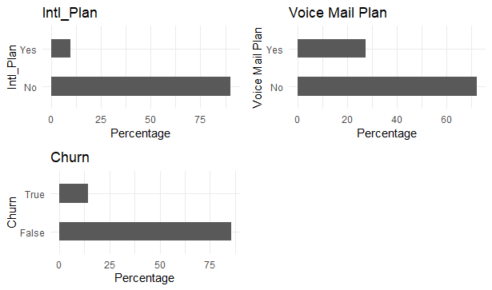
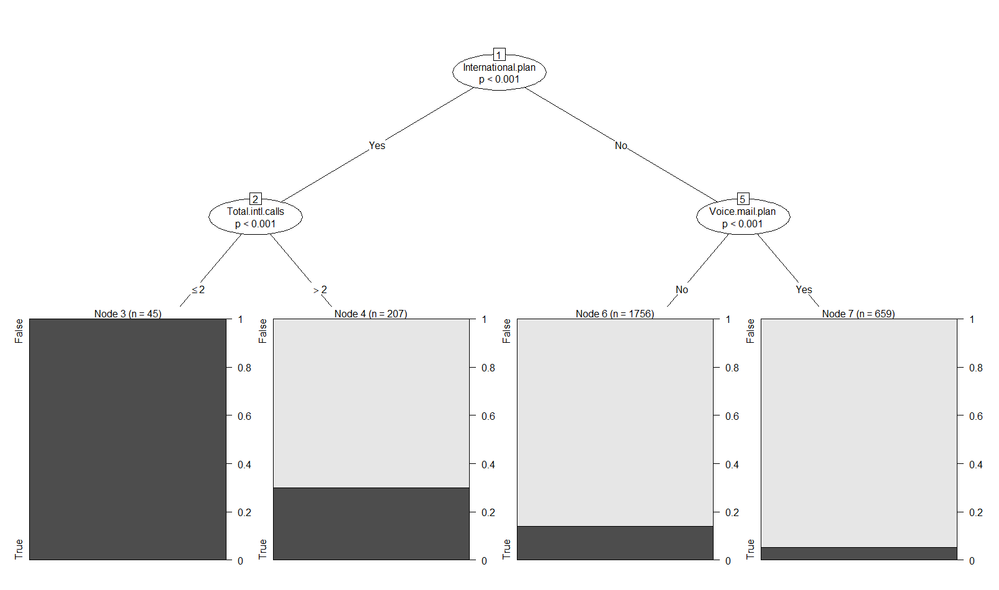
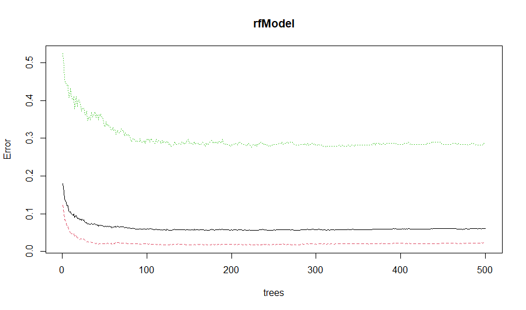
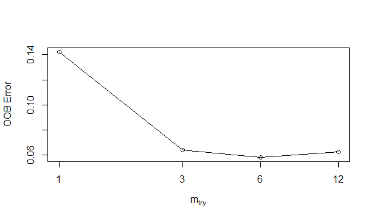
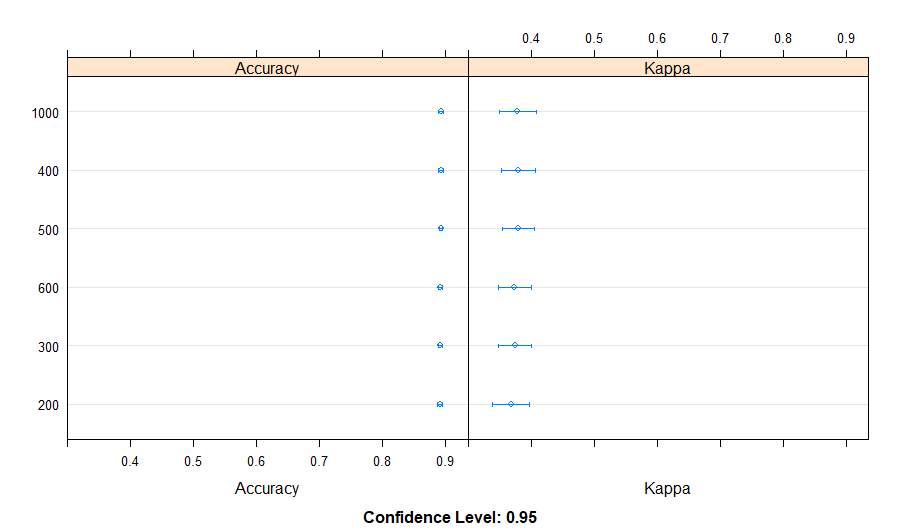
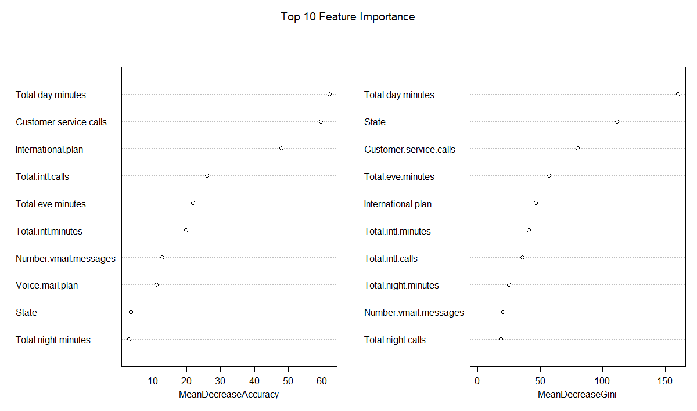

# **Churn-Prediction-With-Telcom-Data**

### Comparing Logistic Regression, Decision Tree and Random Forest for Churn Prediction

For any company providing services with recurring billing understanding and predicting customer churn is important. And with adequate data, machine learning and predict those customers who are likely to jump ship or seek services elsewhere. This has a significant impact on the company's bottom line.

This exercise utilised the data from the Telcom Churn Dataset <https://www.kaggle.com/datasets/mnassrib/telecom-churn-datasets>

The codes tested and compared Logistic Regression, Decision Tree and Random Forest for this classification problem.

Analysis were carried out in stages

#### **Data Processing**

This includes:

-   reading the datasets,
-   combining them,
-   checking for missing values,
-   exploratory data analysis (EDA),
-   generating correlation tables,
-   removal of redundant variables,
-   exploration of the categorical variables, and
-   
-   splitting the dataset into training and testing sets.

### Prediction exercise

#### Fitting the Logistic Regression Model

-   Computing the variance table for examination of feature importance

-   Assessing the predictive ability of the Logistic Regression model

    RESULT: "Logistic Regression Accuracy 0.854354354354354

-   Generating the Confusion Matrix

-   Computing the Odd ratios

    RESULTS: Intl plan, Intl call, voice mail plan and State VT greatly increase the odds of Churn 8 - 9 folds

    #### Decision Tree

-   Using those variable which increased the odds the most for simplicity sake

    -   State+International.plan+Voice.mail.plan+Total.intl.calls

RESULT : "Decision Tree Accuracy 0.866366366366366"

Decision tree accuracy was slightly better than Logistic Regression Model.

Can Random Forest do better? Let's find out.

#### Random Forest Model

Initial Model was constructed

randomForest(formula = Churn \~ ., data = training)

Type of random forest: classification

Number of trees: 500

No. of variables tried at each split: 3

OOB estimate of error rate: 6%

Confusion matrix:

False True class.error

False 2230 50 0.02192982

True 110 277 0.28423773

and error rate plot produced

and tuning was carried out example OOB error rate for Mtry is show below

Thus, indicating mtry value of 6 is appropriate

Ntree was also test with results shown below

Final model results on the training dataset

randomForest(formula = Churn \~ ., data = training, ntree = 200, mtry = 6, importance = TRUE, proximity = TRUE)

Type of random forest: classification

Number of trees: 200

No. of variables tried at each split: 6

OOB estimate of error rate: 5.92%

Confusion matrix:

False True class.error

False 2226 54 0.02368421

True 104 283 0.26873385

OOB error rate increased to 6.07% from 5.85% (initial model), but Class error improved 28.1% for Churn compared to the initial 30.7% (training dataset). Class Error for non-churn increased from 1.36% to 2.32%

Results on Testing dataset

Confusion Matrix and Statistics

Reference

Prediction False True

False 555 29

True 15 67

Accuracy : 0.9339

95% CI : (0.9123, 0.9516)

No Information Rate : 0.8559

P-Value [Acc \> NIR] : 2.232e-10

Kappa : 0.715

Mcnemar's Test P-Value : 0.05002

Sensitivity : 0.9737

Specificity : 0.6979

Pos Pred Value : 0.9503

Neg Pred Value : 0.8171

Prevalence : 0.8559

Detection Rate : 0.8333

Detection Prevalence : 0.8769

Balanced Accuracy : 0.8358

'Positive' Class : False

The improved and the initial model have similar accuracy for the testing dataset. However, specificity improved for the improved model from 64% to 78% and sensitivity declined from 98.9% (initial) to 97.37% (improved).

Now that we have a tuned model, the next question is : which variables are the most valuable for the model?

#### Random Forest Feature Importance

Variable Important Test results

Results shows that

From the MDA - total Day minutes, customer service calls and international plan are the most important.

While from the MDG, in addition to total day minutes and customer service calls and State is also a good variable for separating Churn from Non-churn customers.

### Summary

Random forest (93% accuracy) performed better than Decision Tree and Logistic regression for this classification problem.
